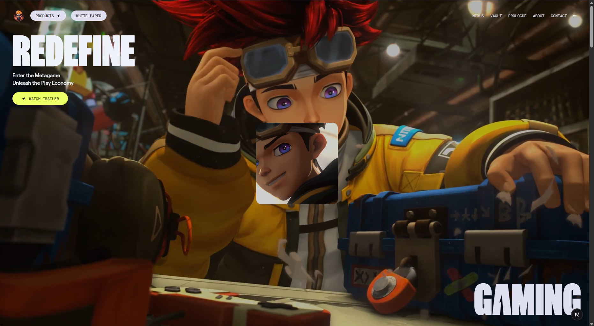
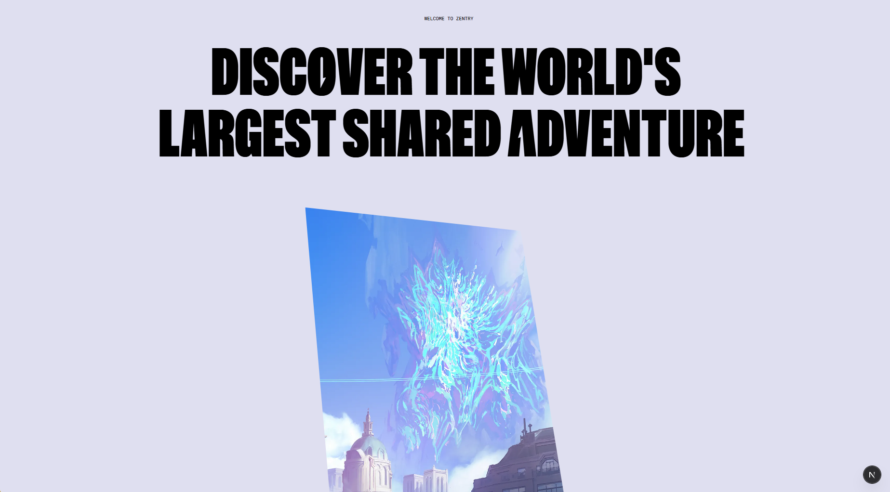
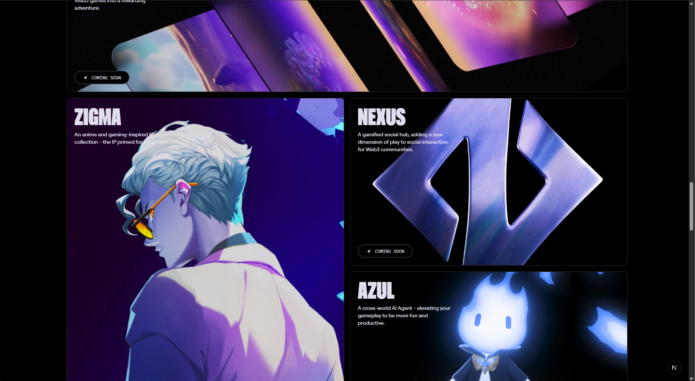
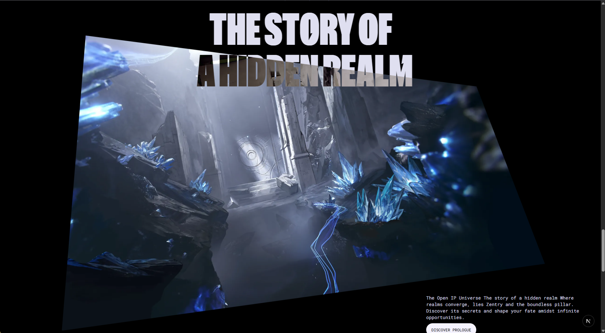
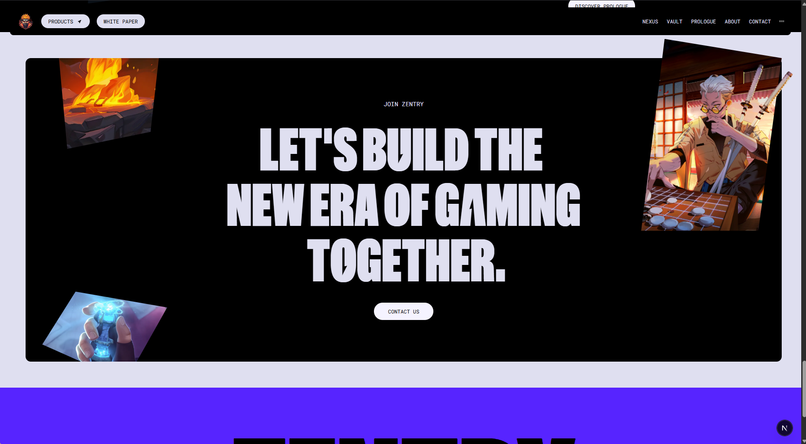

# Zentry Clone App

a web application inspired by **Zentry**, build with Next & GSAP for animation.

## Preview

<p align="center">
  
  
  <br/>
  
  
  <br/>
  
</p>

## 🛠 Tech Stack

- [Next.JS](https://nextjs.org/)
- [GSAP](https://gsap.com/)
- [Tailwind](https://tailwindcss.com/)

## 📦 Installation

follow these steps to get started:

```bash
git clone https://github.com/MammonXXIX/zentry-clone.git

cd zentry-clone

npm install

npm run dev
```
